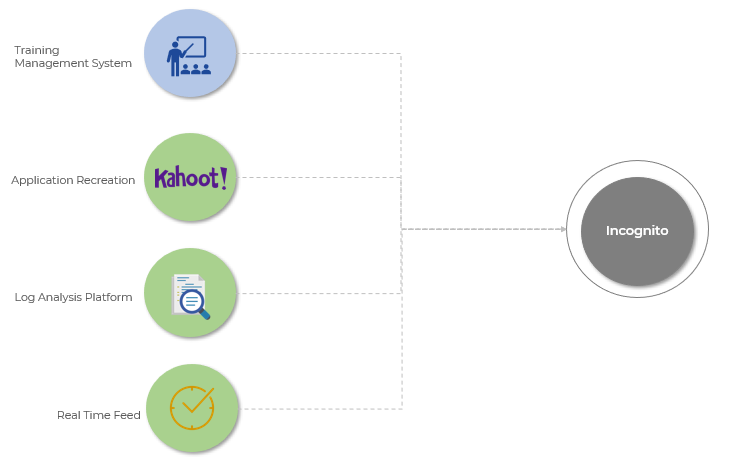
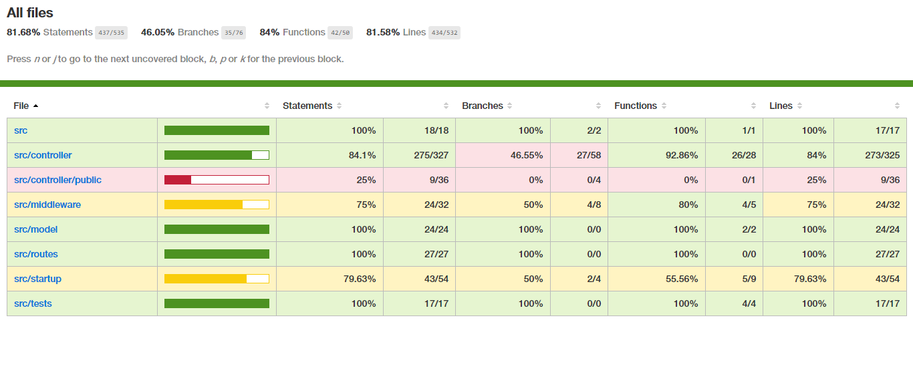
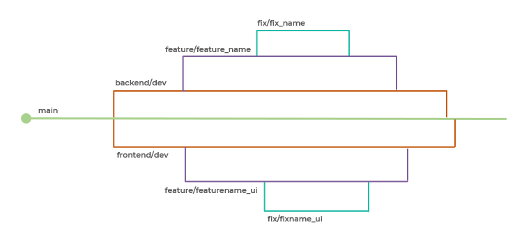

# Incognito
Incognito is an envisioned Training Management System for business organizations, with its initial version as a realtime infotainment quizzing platform, built as a solution for hackerflow.io hosted by [Survey Sparrow](https://surveysparrow.com/). 

### Contents

1. [Problem Statement](#problem-statement)
2. [Scope of Ideation](#scope-of-ideation)
3. [Vision](#vision)
4. [Utilize application](#utilize-application)
5. [Technologies](#technologies)
6. [Application Features](#application-features)
7. [API Contracts](#api-contracts)
8. [Local Deployment](#local-deployment)
9. [Test Run](#test-run)
10. [How To Contribute](#how-to-contribute)
11. [Licensing](#licensing)

*Due to the use of Google signin for authentication which requires an SSL certificate we couldnt host frontend of the application in account to lack of time. Please use [local deployment](#local-deployment) for visualization.* 

### Problem Statement
***
It has been mandatory and habitual for all modern ventures, be it big or small, to practice onboarding or continual training for their employees as a guidance and evaluation technique. Extrapolating an existing **game based learning platform to an extensible Training Management system** surfaced upon noticing its requirement even in our company, where training assessments and its analysis is still highly tedious and pricey. Even in unpredictable scenarios, as we are facing now, remote learning should be engaging enough to plug in individuals through virtual interactions. Recreating [Kahoot](https://kahoot.com/) is our first step towards automating this Knowledge Transfer in organizations.

### Scope of Ideation

<p align="center">

</p>

<center> Fig 1: Ideas that lead to Incognito  </center>

Incognito is designed as a culmination of a live requirement of Training Management System in our organization with all the idea proposals suggested by hackerflow.io team including recreation of an application, log analysis platform and a real time feed application.  

### Vision 
*** 
Incognito is envisioned to be extrapolated to an automated Training Management System for organizations capable of :

1. Maintaining multiple roles within the firm including trainers, trainees, admins and superusers.  
2. Supporting the management of batches of trainees who get acquianted periodically.
3. Providing educational content which could be specific to organiation or in integration to popular online education platforms. 
4. Hosting assessments, that are of non textual content as well (Images, audio, video), with multiple criterias for trainees belonging to certain training groups.
5. Monitoring status and evaluating performance of trainees against assessments.
7. Batchwise and invidiual performace visualization techniques. 
6. Feedback for trainers and superiors

### Utilize application
***
1. [**View screenshots of Incognito functionalities**](https://drive.google.com/drive/folders/1JHTboM1XwNavpYsW3ymrUPLSmcmDaCQJ)

2. [Backend base URL](http://15.206.15.125/)

3. [Elastic Search - Kibana dashboard for log monitoring](https://search-hack-logs-es-dxqxxfmbxn4evkcsendtfmb5zi.us-east-1.es.amazonaws.com/_plugin/kibana)

4. [Jenkins (CI/CD)](http://13.234.115.231)

### Technologies
***
1. **MERN Stack**
   - MongoDB
   - Express
   - React
   - Node.js

2. Communication
   - Websocket
   
3. Deployment
   - Docker   
   - Jenkins
   - AWS EC2

4. Log Analysis
   - File Beat + ELK (Elasticsearch, Logstash, Kibana)
   
### Application Features
***
1. Basic Features
   - Google account based authentication and role based authorization for **Host and Player**.
   - 3 fold format : Group of questions forms a *Kahoot*, a live kahoot becomes a *Game* and a set of kahoots is termed as a *Collection* in Incognito. **This format is specifically designed to escalate the platform to handle training where assessments could be categorized or segmented.** 
   - A kahoot can exist individually as well, without being part of a collection.
   - An authenticated host is authorised to create, update and delete questions within quizzes and quizzes as a whole. 
   - A player can use a *unique PIN* generated during hosting to login to a hosted. 
    - A persisted Kahoot can be hosted multiple times with different PINs.
    - Number of players can be limited within a game as well as the host can choose whether or not to lock player entries once the game has begun. 
2. Quiz Features
   - Incognito_v1 is built to support Multiple Choice and Yes/No questions with textual content.
   - Host screen will be displayed with questions and corresponding choices, while player screens will be prompted with just the choices to opt from.
3. Scoring Quizzes
   - Scoring of individual questions is based on the correctness and the time taken to answer it.
   - A ranking based leaderboard is calculated realtime from the persisted scores during a game. 
  
### API Contracts
***
**View detailed API contracts for Incognito_v1.0 at** [Backend API Contract Documentation](https://docs.google.com/document/d/18YGle9WJ-l6LkDACGzGFWmv0_ixxb9b4CYoy__KQpRs/edit)

### Local Deployment
***
1. Start MongoDB database
```sh
docker run -d -p 27017:27017 -v ./db:/data/db --name mongodb mongo
```

2. Start Backend service
```sh
cd ./backend-service (Expecting your current directory is root directory of git repo)
npm install / yarn install (One time command)
npm start / yarn start

Health Check: (http://localhost:3000) http Method(GET)
```

3. Start Frontend app
```sh
cd ./frontend-service (Expecting your current directory is root directory of git repo)
npm install / yarn install (One time command)
npm start / yarn start
```

### Test Run
***
1. To initiate Unit Test 
```sh
cd backend-service/
npm run unit-test
```
2. To initiate Integrated Test
```sh
cd backend-service/
npm run integration-test
```

<p align="center">

</p>

<center> Fig 2: Coverage report for combined test  </center>

> View detailed coverage report in *backend-service/coverage/lcov-report/index.html*


### How To Contribute
***
Incognito_v1.0 has the following dev pattern where *main branch* functions as the master with child branches assigned for both backend and frontend of the application. Every feature of Incognito from these two aspects have been developed and merged using independetly assigned branches. Fixes associated with different features were also worked upon individually to follow strict and standard development pattern.

<p align="center">

</p>

<center> Fig 3: Dev pattern of Incognito  </center>

To contribute: 
1. Fork this repository to get your copy on GitHub.
2. Clone the project to your own machine.
3. Work on features and commit changes to your own branch.
4. Push your work back up to your fork.
5. Submit a Pull Request so that we can review your changes.

### Licensing
*** 
View Incognito licensing at [LICENSE](LICENSE)